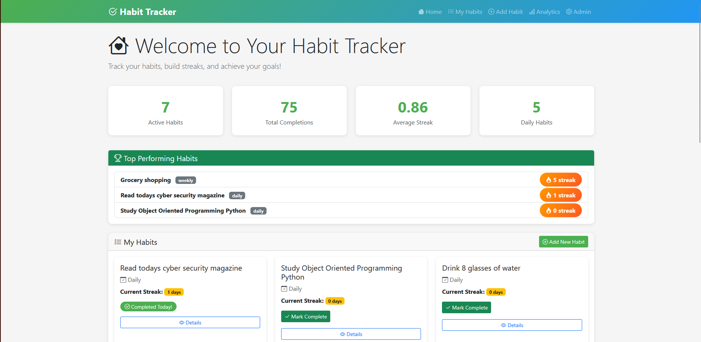
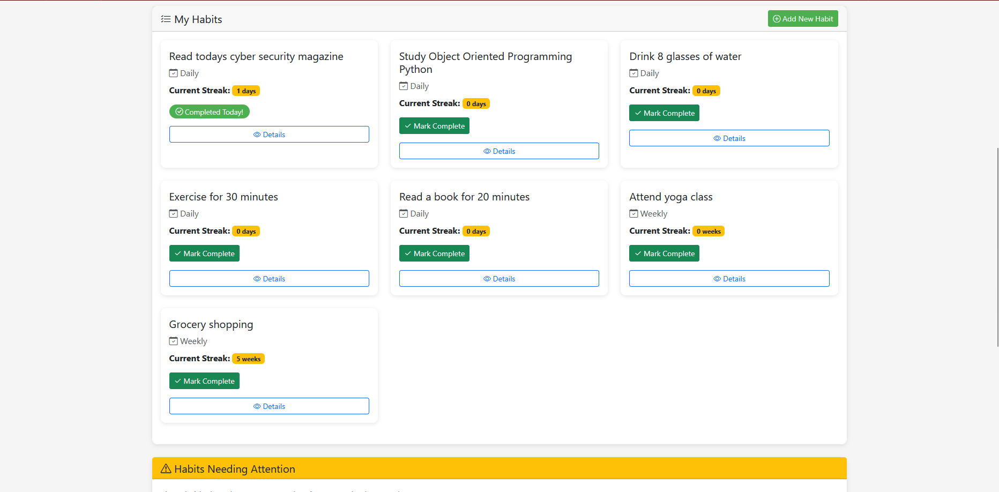

# Habit Tracker App

<!-- <p align="centre">
  
<p> -->

<p align="center">
  
</p>

Build better routines, one checkmark at a time.

This is a Django-based habit tracking app where you can create habits, mark them as complete, and track progress with streaks and analytics. It was developed as part of the **DLBDSOOFPP01** (Object-Oriented and Functional Programming with Python) portfolio assignment.

## What this app does

- Create habits with **daily** or **weekly** periodicity
- Mark habits complete for the current period
- Track **current streak** and **longest streak**
- View analytics for best-performing and struggling habits
- Use JSON API endpoints for habits and analytics

[](assets/videos/demo.mp4)

<!-- <video width="600" controls>
  <source src="assets/videos/demo.mp4" type="video/mp4">
</video> -->

## Tech stack

- Python (3.7+)
- Django
- SQLite
- Pytest
- Bootstrap (templates/UI)

## Quick start

If you want the fastest path, follow [QUICKSTART.md](QUICKSTART.md).

### 1) Set up the project

```bash
# Clone and enter project
cd Habit_Tracker-App

# Create and activate virtual environment
python -m venv venv

# Windows
venv\Scripts\activate

# macOS/Linux
source venv/bin/activate

# Install dependencies
pip install -r requirements.txt

# Prepare database
python manage.py migrate

# Optional: load sample data
python manage.py populate_habits
```

### 2) Run the app

```bash
python manage.py runserver
```

Open: http://127.0.0.1:8000/

## Typical workflow

### Create a habit

1. Click **Add New Habit**
2. Enter a task name (example: *Exercise for 30 minutes*)
3. Choose **Daily** or **Weekly**
4. Click **Create Habit**

### Complete a habit

- From Home: click **Mark Complete**
- From Detail page: click **Mark as Complete**

### Check progress

- **Home dashboard**: streaks + quick status
- **Analytics page**: grouped insights, best performers, habits needing attention
- **Habit detail**: completion history and rates

## Streak logic (simple explanation)

- **Daily habit**: complete at least once each day to keep streak alive
- **Weekly habit**: complete at least once each week (week starts Monday)
- Missing a period resets the streak

## API endpoints

### Get all habits

```http
GET /api/habits/
```

Example response:

```json
{
  "success": true,
  "habits": [
    {
      "id": 1,
      "task": "Exercise for 30 minutes",
      "periodicity": "daily",
      "created_at": "2026-01-27T10:00:00Z",
      "is_active": true,
      "current_streak": 5
    }
  ],
  "count": 1
}
```

### Get analytics

```http
GET /api/analytics/
```

Example response:

```json
{
  "success": true,
  "statistics": {
    "total_habits": 5,
    "daily_habits": 3,
    "weekly_habits": 2,
    "total_completions": 72,
    "average_streak": 3.4
  },
  "longest_streak": {
    "habit": {
      "id": 3,
      "task": "Read a book",
      "periodicity": "daily"
    },
    "streak": 11
  },
  "best_performers": []
}
```

## Testing

Run the test suite:

```bash
pytest
```

Useful variants:

```bash
pytest -v
pytest habits/tests.py
pytest --cov=habits --cov-report=html
```

The project currently includes **27 tests**.

## Project structure

```text
Habit_Tracker-App/
├── habits/
│   ├── management/commands/populate_habits.py
│   ├── migrations/
│   ├── templates/habits/
│   ├── analytics.py
│   ├── models.py
│   ├── tests.py
│   ├── urls.py
│   └── views.py
├── habit_tracker_project/
│   ├── settings.py
│   ├── urls.py
│   ├── wsgi.py
│   └── asgi.py
├── manage.py
├── requirements.txt
├── pytest.ini
├── QUICKSTART.md
└── README.md
```

## Development notes

### Database operations

```bash
python manage.py makemigrations
python manage.py migrate
```

### Reset local database

```bash
# delete db.sqlite3, then run:
python manage.py migrate
python manage.py populate_habits
```

## License

Educational project for the DLBDSOOFPP01 course.

## Acknowledgments

- Django
- Bootstrap
- Pytest
- Course instructors and assignment framework
